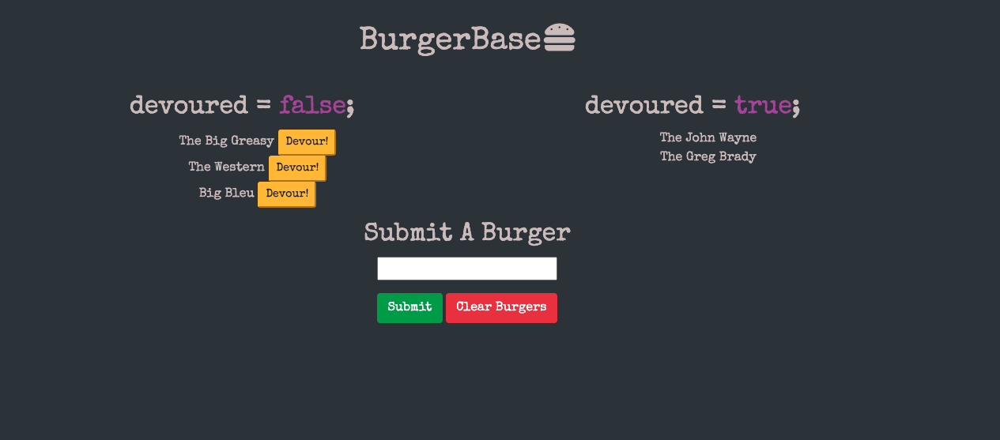

# BurgerBase
    

An application used to log your burgers!  Built with Node.js, Express, MySQL, Handlebars, and ORM.



View the deployed application here <a href = "https://warm-atoll-97032.herokuapp.com/">here</a>

## Table of Contents
* [Installation](#installation)
* [Usage](#usage)
* [Screenshots](#screenshots)
* [Resources](#resources)
* [Contributions](#contributions)
* [Testing](#testing)
* [Questions](#questions)
* [License](#license)


## Installation

If you would like to use the application in your local environment: 
1. Clone the repo
2. Install required dependencies by running command ```npm i```
3. Edit ```connection.js``` file to match your MySQL credentials
4. Use ```schema.sql``` file to insert tables into MySQL

5. Run command ```node server``` to get started

Otherwise, visit the deployed application here <a href = "https://warm-atoll-97032.herokuapp.com/">here</a>

## Usage
Type in a burger in the input field to add the burger to the list and click the "devour" button to devour it!  Use the "Clear Burgers" button to start from scratch.

## Resources
**Node.js** <br>
**MySQL** <br>
**Handlebars** <br>
**Express** <br>
**Bootstrap** <br>
**Object Relational Mapping** (ORM) <br>
**Font Awesome** <br>
**Google Fonts**

## Contributions
All contributions to this project are welcome!  Clone down the repo to your local machine, commit changes, push to GitHub, and open a pull request!

## Testing
No tests are set up for BurgerBase at this time.  Feel free to write tests or search the application for bugs.

## Questions
If you have any further questions, feel free to reach out to me! <br>
<a href='https://www.github.com/twkirkpatrick'>Github</a> <br>
<a href='mailto:twk4491@gmail.com'>twk4491@gmail.com</a>

## License
Usage is provided under the MIT license.
